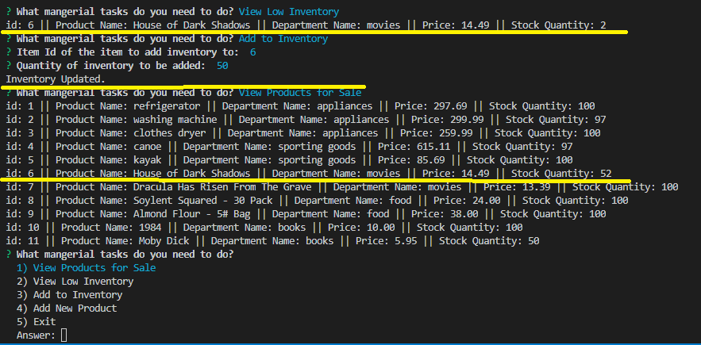

## bamazon

#### bamazon is a sales/inventory/management tool which consists of three JavaScript modules: bamazonCustomer, bamazonManager, and bamazonManager. Each of these modules use MySQL, JavaScript, and node.js technologies. All modules use npm inquirer to construct a user interface using questions. Each module connects to MySQL via npm mysql. A database called bamazon is created for local storage in MySQL which contains tables called products and departments.

### bamazonCustomer allows a customer to purchase an item after viewing a list of available items retrieved from the products table in the bamazon database. 

#### The customer must enter a valid Id number for the purchase. If an invalid Id number is entered, a message is displayed.

#### If there is not sufficient inventory to fulfill the cusomer's request, a message is shown.

#### When a sufficient number of items are available in inventory, the customer's purchase is completed and the number of items and total cost are displayed. In all cases, the customer is take back to the start menu.

### bamazonManager provides the following tools: view all products for sale, view producs with less than 5 items in inventory, add more items to current inventory, and add a new product to the product list.

#### The manager's view of inventory is the same that is displayed to the customer when making a purchase which is retrieved from the products table.

#### When there is less than 5 items of a product in the inventory, the manager is alerted.

#### The manager may add to the number of items of product by entering the product Id number and the quantity to be added.

#### An entirely new product may be added to inventory by the manager. To do so, the manager must enter the product name, department for the product, the price of the item and the quantity intially available.

### bamazonSupervisor can be used to display overhead cost, total sales, and profitability by department. The manager can also add a new department to the departments table.

#### The table used by the supervisor is created by using a right join to display the departments table and the sum of product sales from the products table. A profitibility calculation is made using the overhead from the departments table and the sum of product sales from the products table.

#### The supervisor can add a new department to the departments table by entering the department name and over head costs.

#### This may be a department that is has no items in the products table so that when a the manager Views the Product Sales an error would be caused by having a null value returned for product sales, so the code includes a substitution of 0 for null so that the value can be displayed.

#### bamazon was constructed by me as the sole contributor. Any questions regarding the use of this program can be directed to me at ronfud2000@gmail.com - hope you enjoy using it!